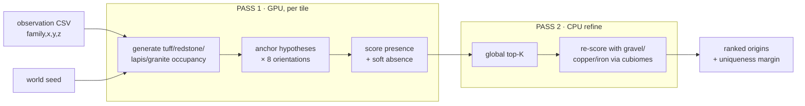

<div align="center">

# orereversal

**Pinpoint a Minecraft location from the ore in its walls.**

GPU-accelerated, known-seed world localization from exposed ore patterns, for Minecraft Java 1.18+.

[](LICENSE)


</div>

---

Given a world seed and the ore blocks visible on the walls of a dug-out room, orereversal finds the
room's absolute position in the world. You don't need its coordinates or which way it faces. It
reports a ranked list of candidates and a confidence margin that tells you whether the best match is
unique in the searched region.

```text
$ cuda/matcher.exe 123 -32 31 -32 31 examples/obs_big_room.csv
obs: 633 ore + 3791 bare | search 4096 chunks | anchor=lapis(1) tile=256 ...
scanned 1 tiles | 62495 anchor candidates | 7 survivors (minfrac pre-filter) | top-K=3

(refined top 3 with all 7 families incl. gravel/copper/iron)
rank           world_origin        chunk  orient    present     absH     final
   1          (-6, -52, -6)     (-1, -1)    r0m1 633/633        0     633.0
   2          (-7, -50, -7)     (-1, -1)    r0m1 369/633      188     181.0
   3      (-159, -26, -187)   (-10, -12)    r2m-1 286/633      621    -335.0

top_final=633.0 margin=452.0 => CONFIDENT (unique)
```

<sub>About 1.5 s end-to-end on an RTX 4070 Ti SUPER. The true origin of this example room is (-6, -52, -6).</sub>

## Contents

- [Highlights](#highlights)
- [How it works](#how-it-works)
- [Requirements](#requirements)
- [Quick start](#quick-start)
- [Usage](#usage)
- [Performance](#performance)
- [Validation](#validation)
- [Limitations](#limitations)
- [Repository layout](#repository-layout)
- [Acknowledgements](#acknowledgements)
- [License](#license)

## Highlights

- **Works without terrain simulation.** Four ore families are generated *bit-exactly* on the GPU
  from the seed alone. The terrain density functions aren't needed.
- **Orientation-agnostic.** All 8 horizontal rotations and mirrors are tested, so relative
  coordinates in any consistent frame are enough.
- **Recall-safe.** Every candidate of the rarest observed family is tested as a hypothesis, so the true
  location can't be pruned before scoring.
- **Soft absence scoring.** Exposed plain stone (`bare`) penalizes candidates that predict ore where
  there isn't any. This removes false positives that only match on presence.
- **World-scale.** The search is tiled, so memory stays bounded for any region size. 29M chunks are
  scanned in about 21 s.
- **Tolerant of sloppy input.** `--error N` matches within ±N blocks, for coordinates that weren't
  extracted exactly.

## How it works

Since 1.18, ore placement is deterministic given the world seed and the chunk. Each chunk's veins
come from a population seed, and the veins are drawn as line segments of overlapping spheres. Terrain
can only *remove* ore: caves, air and non-stone blocks never get replaced. So the ore you can actually
see is a **subset** of the positions the RNG predicts. Because of that, a candidate location can be
confirmed without simulating any terrain.

Matching individual veins isn't enough. Matching the **full fine structure** of every exposed block
is. A large carved room produces a fingerprint that is unique across the world.



### Ore families

Real worldgen couples ore to terrain in three ways. Only some families survive all three. See
[`cuda/README.md`](cuda/README.md#which-ore-families-and-why) for why.

| Family | Status | Notes |
|---|---|---|
| tuff, redstone, lapis, granite | **GPU, bit-exact** | Discard-free. These carry the search. |
| gravel, copper | Refine (CPU) | Bit-exact via cubiomes, but they need the surface-height gate that the GPU port doesn't have. Gravel falls once disturbed, so treat it as a bonus. |
| iron | Refine (CPU) | The 1.18 ore-vein noise isn't simulated, so a few real blocks are missed. Treat it as a bonus. |
| diamond, gold, coal | **Excluded** | `discardChanceOnAirExposure > 0` desyncs the RNG against real terrain. |

## Requirements

| | Tested with |
|---|---|
| GPU | NVIDIA, compute capability 8.9 (RTX 40-series). Other architectures need a rebuild for that arch. |
| CUDA Toolkit | 12.9 |
| Host compiler | Windows: MSVC (VS 2022 Build Tools, C++ workload). Linux: gcc 13. OpenMP on both. |
| cubiomes build | `gcc` + CMake (MinGW on Windows, because cubiomes' CMake rejects MSVC) |
| CPU reference solver | Python 3, standard library only |

## Quick start

**1. Clone this repo and cubiomes.** cubiomes isn't vendored. It's pinned to the fork that carries
the 1.18 ore configs:

```sh
git clone https://github.com/Hexay/oreReversal.git orereversal
cd orereversal
git clone https://github.com/xpple/cubiomes.git
git -C cubiomes checkout 62007b8c6260290a3951f8ea9ce4a41e60dd1b54
```

**2. Build the cubiomes harness.** This step produces `harness/region_dump`, which the refine pass
calls, and `harness/ore_dump`. On Windows, run it from Git Bash or MSYS2 with MinGW on `PATH`.

```sh
bash harness/build.sh
```

**3. Build the GPU matcher.**

On Linux, with `nvcc` on `PATH`:

```sh
bash cuda/build.sh                # targets the local GPU; override with ARCH=sm_86 etc.
```

On Windows, run `cuda\rebuild.bat`. It calls `vcvars64.bat` from VS 2022 Build Tools, puts CUDA 12.9 on
`PATH`, and builds for `sm_89`. Edit those three lines in the script if your setup differs.

**4. Run the example** (seed `123`, a 64 × 64-chunk region around the origin):

```sh
cuda/matcher 123 -32 31 -32 31 examples/obs_big_room.csv      # cuda\matcher.exe on Windows
```

## Usage

```text
matcher.exe <seed> <cxMin> <cxMax> <czMin> <czMax> <obs.csv> [options]
```

The search region is given in **chunk** coordinates, inclusive. The matcher searches the deepslate
band (Y −64 to −1).

| Option | Default | Description |
|---|---|---|
| `--error E` | `0` | Positional tolerance for ore cells, in blocks. Use 1–2 for coordinates that weren't extracted exactly. |
| `--abs-error A` | `0` | Positional tolerance for `bare` cells. Leave it at 0 unless the bare cells are misread too, because widening them next to dense tuff floods the absence score. |
| `--absw W` | `1.0` | Weight of each absence hit (ore predicted on a `bare` cell). |
| `--minfrac F` | `0.5` | Presence pre-filter: the fraction of GPU-family ore a hypothesis must hit to survive pass 1. |
| `--tile T` | `256` | Tile size in chunks. Values above 320 risk a Windows TDR reset, so they're clamped. |
| `--topk K` | `4096` | Number of pass-1 survivors kept across tiles. |
| `--refine N` | `64` | Number of top hypotheses re-scored with every family in pass 2. |
| `--no-refine` | | Run GPU pass 1 only (4 families). |
| `--legacy-gen` | | Use the original one-thread-per-chunk generator. This is the bit-exact reference and runs about 3× slower. |

### Observation format

The observation is a CSV with one exposed block per row. Coordinates can be relative to any origin
and use any horizontal orientation. Only Y has to be the real in-game height.

```csv
family,x,y,z
lapis,0,-49,0
redstone,4,-50,2
tuff,1,-48,3
bare,2,-49,0
```

Each row is one of the following:

- A usable family: `tuff`, `redstone`, `lapis`, `granite`, `gravel`, `copper` or `iron`.
- `bare`, for plain `stone` or `deepslate`.
- **Omitted**, for anything else (air, lava, water, other ores, andesite/diorite).

Labeling caves as `bare` penalizes the true location. The full rules are in
[`docs/observation-format.md`](docs/observation-format.md).

### Reading the output

| Column | Meaning |
|---|---|
| `world_origin` | World position of the observation's relative `(0,0,0)` |
| `orient` | Rotation `r0`–`r3` (90° steps) and mirror `m±1` that align the observation |
| `present` | Observed ore cells that the seed predicts at this origin |
| `absH` | `bare` cells where the seed predicts ore (absence hits) |
| `final` | `present − absw × absH` |

`margin` is the gap between the first and second `final` scores. The result is **CONFIDENT** when the
margin is at least `max(3, 0.3 × N_ore)`. Otherwise the output is a shortlist.

### CPU reference solver

`python/solve.py` implements the same two-stage algorithm in pure Python over a small region. It is
useful for checking the GPU path or for experimenting:

```sh
py -3 python/solve.py examples/obs_big_room.csv --seed 123 --region 13
```

`python/make_observation.py` generates a synthetic observation (a carved room) at a known location,
for testing.

## Performance

These numbers are from an RTX 4070 Ti SUPER (consumer Ada, FP64 at 1/64 rate).

| Search | Chunks | Wall time |
|---|---|---|
| Example room (above) | 4,096 | ~1.5 s incl. refine |
| Large region, `--no-refine` | 29.2 M | ~21 s |
| 300k × 300k blocks (projected) | ~352 M | ~4.3 min |

Optimization took the generator from 48 min to about 4 min for a 300k² region. The main steps were a
two-kernel split, a mixed-precision distance test with an FP64 boundary shell, a column-analytic
sphere union, and Morton-sorted scoring. Several dead ends were measured and abandoned along the way.
The full write-up is in [`docs/gpu-optimization.md`](docs/gpu-optimization.md). The reusable
methodology is in [`docs/cuda-playbook.md`](docs/cuda-playbook.md).

## Validation

- **Generator.** `cuda/oretest.c` produces zero position diffs against cubiomes for tuff, redstone,
  lapis and granite.
- **Real world.** Two carved rooms in a real 1.18.2 world (seed 123) were both ranked #1 with
  every ore cell matched and no absence hits:

  | Room | Ore cells | Margin |
  |---|---|---|
  | 1 | 352 / 352 | 294 |
  | 2 | 589 / 589 (cuts through a lava cave) | 522 |

- **Uniqueness.** The margin stays flat or grows as the search region grows 31× and beyond, because
  absence scoring suppresses far-away false positives.

The research log in [`docs/research-log.md`](docs/research-log.md) covers each experiment, the
precision budget, and every negative result.

## Limitations

- **Known seed only.** orereversal localizes a position. It doesn't crack seeds.
- **Deepslate band.** The search covers Y −64 to −1, where the bit-exact families dominate.
- **You need a decent-sized observation.** A large carved room is world-unique. A few scattered
  veins are not. As a rule of thumb, aim for hundreds of cells including about 20 or more of the
  sparse families.
- **The Linux GPU path hasn't run on a GPU yet.** On Ubuntu 24.04 everything builds without warnings,
  and the harness, golden diff and Python solver match Windows exactly. But the matcher itself has only
  been executed on Windows.
- **Gravel moves.** It is placed suspended at generation and falls once a block update reaches it,
  so in an explored room its contribution is only a bonus.

## Repository layout

| Path | Contents |
|---|---|
| [`cuda/`](cuda) | **The GPU matcher.** `oregen.h` is a portable host/device port of cubiomes' 1.18 ore generation. `matcher.cu` is the tiled two-pass localizer. |
| [`harness/`](harness) | C tools that dump ground-truth ore candidates from cubiomes. The refine pass calls `region_dump`. |
| [`python/`](python) | Python CPU reference: `solve.py` (the solver), `make_observation.py` and `gen_wall.py` (synthetic observations), and `candidates.py` (shared cubiomes wrapper). |
| [`python/research/`](python/research) | The earlier research matchers that the research log cites. Kept for reproducibility. |
| [`examples/`](examples) | Observation CSVs: synthetic rooms and walls, and `real_pol*` (extracted from a real world). |
| [`docs/`](docs) | Observation format, research log, GPU optimization log, and the CUDA playbook. |

## Acknowledgements

- [cubiomes](https://github.com/Cubitect/cubiomes) by Cubitect, via the
  [xpple/cubiomes](https://github.com/xpple/cubiomes) fork (commit `62007b8`) for the 1.18 ore
  configs. The ore-generation port in `cuda/oregen.h` was hand-derived from this source.

## License

[MIT](LICENSE). cubiomes is distributed under its own MIT license.
