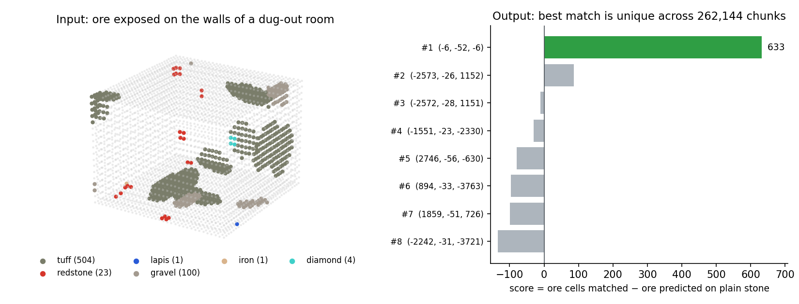

<div align="center">

# orereversal

**Recover where a Minecraft screenshot or video was taken from the ore visible in it.**

[](LICENSE)




</div>

Ore placement is fully determined by the world seed, so the ore exposed in a wall fingerprints where
that wall is. Given the seed and the blocks visible in a dug-out room, written down as an
[observation CSV](docs/observation-format.md), orereversal finds the room's absolute coordinates on
the GPU, with no prior guess at the location or the camera's facing, and says whether the match is
unique.

```text
$ cuda/matcher 123 -32 31 -32 31 examples/obs_big_room.csv
rank           world_origin        chunk  orient    present     absH     final
   1          (-6, -52, -6)     (-1, -1)    r0m1 633/633        0     633.0
   2          (-7, -50, -7)     (-1, -1)    r0m1 369/633      189     180.0
   3      (-159, -26, -187)   (-10, -12)    r2m-1 286/633      623    -337.0

top_final=633.0 margin=970.0 (vs best surviving hypothesis >33 blocks away) => CONFIDENT (unique)
```

<sub>About 0.5 s on an RTX 4070 Ti SUPER. Rank 2 is a shifted copy of the winner, so the margin is
measured against rank 3.</sub>

## How it works

Since 1.18, each chunk's ore veins follow from the seed alone, and terrain can only *remove* ore. The
ore you can see is therefore a subset of what the RNG predicts, so a location can be checked without
simulating terrain.

1. **Pass 1 (GPU).** Generate tuff, redstone, lapis and granite bit-exactly for each tile of the
   search region. Every candidate of the rarest observed family, in all 8 rotations and mirrors, is a
   hypothesis, scored on observed ore it explains minus ore it predicts on plain stone (`bare`).
2. **Pass 2 (CPU).** Re-score the top hypotheses with gravel, copper, iron and buried diamond via
   [cubiomes](https://github.com/Cubitect/cubiomes).

Gold and coal are excluded: they're discarded on air exposure, which desyncs the RNG against real
terrain. [`cuda/README.md`](cuda/README.md#which-ore-families-and-why) covers each family.

## Quick start

Requires an NVIDIA GPU, CUDA 12 (tested with 12.9 on sm_89), MSVC 2022 on Windows or gcc on Linux,
and gcc + CMake for cubiomes (MinGW on Windows).

```sh
git clone https://github.com/Hexay/orereversal.git && cd orereversal
git clone https://github.com/xpple/cubiomes.git      # fork with the 1.18 ore configs
git -C cubiomes checkout 62007b8c6260290a3951f8ea9ce4a41e60dd1b54

bash harness/build.sh       # cubiomes tools used by pass 2; Git Bash/MSYS2 on Windows
bash cuda/build.sh          # Linux; on Windows run cuda\rebuild.bat (ARCH=sm_86 etc. to override)

cuda/matcher 123 -32 31 -32 31 examples/obs_big_room.csv
```

## Usage

```text
matcher <seed> <cxMin> <cxMax> <czMin> <czMax> <obs.csv> [options]
```

The region is in chunk coordinates, inclusive, and covers Y −64 to −1. Run `matcher` with no arguments
for every option; the ones you'll usually need:

| Option | Description |
|---|---|
| `--version V` | The world's version, e.g. `1.20.4`. Required for 1.20+, which changed the lapis and copper seeds. |
| `--error E` | Tolerate ore positions off by up to E blocks. Use 1–2 for positions read from footage. |
| `--abs-error A` | The same for `bare` cells. |
| `--tile T` | Tile size in chunks (default 256). Lower it if the GPU runs out of memory. |
| `--no-refine` | GPU pass only. |

The observation lists one exposed block per row, as `family,x,y,z`. X and Z can be relative and in any
orientation; Y must be the real height. Families are `tuff`, `redstone`, `lapis`, `granite`, `gravel`,
`copper`, `iron`, `diamond`, or `bare` for plain stone/deepslate. Leave out everything else: labeling
air or caves as `bare` penalizes the true location.

In the output, `present` counts observed ore the seed predicts, `absH` counts `bare` cells where it
predicts ore, and `final = present − absH`. The result is **CONFIDENT** when the winner beats every
result farther than the room's own width away by at least `max(3, 0.3 × ore cells)`.

`python/solve.py` is a pure-Python reference implementation for small regions.

## Performance and validation

On an RTX 4070 Ti SUPER, a 29M-chunk search takes about 23 s (`bash tests/bench.sh 2702`), and a
300k × 300k-block search is projected at under 5 min. See
[`docs/gpu-optimization.md`](docs/gpu-optimization.md).

The GPU generator matches cubiomes position for position. All 65 rooms carved from a real 1.18.2 world
rank first, with median margins of 278 on land and 244 in low terrain; three of them are in
`examples/`. Experiments and negative results are in [`docs/research-log.md`](docs/research-log.md).

## Limitations

- **Known seed only.** It localizes; it doesn't crack seeds.
- **Java Edition, deepslate band (Y −64 to −1).**
- **Needs a sizable observation:** hundreds of cells, about 20+ of them rare ore. A few veins aren't
  unique.
- **No image reading yet.** Observations are written by hand or extracted from a world save.
- **The Linux build is untested on a GPU.** It compiles cleanly and the CPU paths match Windows.

## Troubleshooting

| Symptom | Fix |
|---|---|
| `region_dump not found` | Run `bash harness/build.sh`, or pass `--no-refine`. |
| CUDA out of memory with free VRAM (Windows) | Windows backs GPU memory with system commit. Close programs or pass `--tile 128`. |
| True location not found or not confident | Check nothing non-stone is labeled `bare`, pass `--version` for 1.20+, use `--error 1` for footage. |

## Development

```sh
bash tests/regress.sh --build      # rebuild, then compare every case byte for byte (needs Python 3)
bash tests/regress.sh --update     # re-record expected output; explain why in the commit
```

[`cuda/README.md`](cuda/README.md) maps the source files.

## License

[MIT](LICENSE). Built on [cubiomes](https://github.com/Cubitect/cubiomes) by Cubitect (MIT), via the
[xpple/cubiomes](https://github.com/xpple/cubiomes) fork. Not affiliated with Mojang or Microsoft; use
it on your own worlds or with permission.
